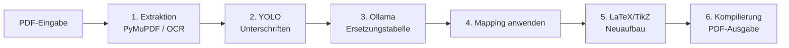

# Local PDF Anonymizer

Anonymisiert PDFs mit sensiblen Informationen – vollständig lokal, ohne dass jemals Dokumentdaten den Rechner verlassen. Ein lokales Ollama-Modell ersetzt Namen, IBANs, Adressen usw. durch erfundene, formatgleiche Werte; Unterschriften werden per YOLO erkannt und entfernt. Layout, Logos und Icons des Originals bleiben erhalten.

## Installation

Voraussetzungen (macOS, via [Homebrew](https://brew.sh)):

```bash
# 1. Ollama + Modell (läuft komplett lokal)
brew install ollama
ollama pull mistral-small3.2:24b

# 2. LaTeX-Compiler
brew install tectonic

# 3. OCR für gescannte PDFs (inkl. deutschem Sprachpaket)
brew install tesseract tesseract-lang

# 4. Python-Umgebung
python3 -m venv .venv
source .venv/bin/activate
pip install -r requirements.txt
```

Beim **ersten Lauf** lädt das Skript automatisch ein YOLO-Unterschriftsmodell von Hugging Face (Fallback: [Mels22/Signature-Detection-Verification](https://huggingface.co/Mels22/Signature-Detection-Verification)). Optional kann das YOLOv8-Modell [tech4humans/yolov8s-signature-detector](https://huggingface.co/tech4humans/yolov8s-signature-detector) nach Lizenzannahme und `huggingface-cli login` unter `models/yolov8s.pt` abgelegt werden.

## Benutzung

Ganzen Ordner verarbeiten (Batch-Modus):

```bash
python anonymize_pdf.py vertraege -o results
```

Einzelne Datei:

```bash
python anonymize_pdf.py vertrag.pdf -o results
```

Ergebnisstruktur:

```
results/
├── pdfs/                              # nur die fertigen anonymisierten PDFs
│   ├── Kaufvertrag1_anonymized.pdf
│   └── ...
├── output_1/                          # vollständiges Ergebnis pro Eingabe-PDF
│   ├── Kaufvertrag1_anonymized.pdf
│   ├── Kaufvertrag1_anonymized.tex    # erzeugte LaTeX-Datei
│   ├── Kaufvertrag1_mapping.json      # Ersetzungstabelle (Original → Ersatz)
│   ├── Kaufvertrag1_run.log.txt        # Lauf-Log (Konsole + Datei)
│   └── assets/                        # extrahierte Bilder, Vektor-PNGs, Scans
│       ├── p0_img42.png               # eingebettete Bilder
│       ├── p0_vec0.png                # gerasterte Vektor-Cluster
│       └── p1_scan.png                # Scan-Hintergründe
├── output_2/
└── ...
```

### CLI-Optionen

| Option | Beschreibung |
|---|---|
| `-o`, `--outdir` | Ausgabeordner (Standard: `results/`) |
| `--model` | Ollama-Modell (Standard: `mistral-small3.2:24b`) |
| `--ollama-url` | Ollama-Server (Standard: `http://localhost:11434`) |
| `--no-llm` | Nur Layout-Rekonstruktion, keine Text-Anonymisierung |
| `--no-signature-filter` | Unterschrifts-Erkennung deaktivieren |
| `--signature-conf` | YOLO-Konfidenzschwelle, 0–1 (Standard: `0.22`; niedriger = mehr Treffer) |
| `--signature-model` | Pfad zu lokaler YOLO-`.pt`-Datei |

### Konfiguration im Code

In `anonymize_pdf.py`:

```python
INFERENCE_DEVICE = "gpu"              # "gpu" oder "cpu"
SIGNATURE_CONF_DEFAULT = 0.22         # niedriger = mehr Unterschriften erkannt
SCAN_OCR_ONLY = True                  # Scan: weiße Seite + OCR-Text statt Scan-Hintergrund
DROP_FULLPAGE_SCAN_BACKGROUNDS = True # Vollseitenbild bei vorhandener Textschicht verwerfen
FULLPAGE_IMAGE_COVERAGE = 0.85        # Schwellwert für „Vollseitenbild" (Anteil der Seitenfläche)
```

Per CLI noch feiner einstellen:

```bash
python anonymize_pdf.py vertrag.pdf -o results --signature-conf 0.15
```

Der Ollama-System-Prompt liegt in **`prompts/ollama_system_prompt.md`** und kann dort ohne Code-Änderung angepasst werden.

## Workflow (Überblick)

1. **Extraktion** – PyMuPDF zerlegt jede Seite: Text mit Position, Schrift und Farbe; eingebettete Bilder als PNG; Vektorgrafiken (Linien, Kurven, Rahmen). Nahe Vektorpfade werden zu Clustern zusammengefasst und als PNG in `assets/` gerastert. Gescannte Seiten werden per Tesseract-OCR mit Wort-Koordinaten gelesen.
2. **Unterschriften filtern (YOLO)** – Alle extrahierten Bilder und Vektor-PNGs werden auf handschriftliche Unterschriften geprüft. Treffer werden aus dem LaTeX/PDF entfernt; auf Scan-Seiten werden erkannte Unterschrifts-Regionen mit Papierfarbe übermalt.
3. **Anonymisierung (Ollama)** – Der Dokumenttext geht an das lokale LLM, das eine Ersetzungstabelle liefert (sensible Angabe → erfundener, formatgleicher Wert). Die Tabelle wird als JSON gespeichert.
4. **LaTeX-Rekonstruktion** – Jedes Element wird per TikZ-Overlay an der Originalposition platziert. Bei Scans wird standardmäßig **kein Scan-Hintergrund** eingebunden (`SCAN_OCR_ONLY`): weiße Seite + alle OCR-Wörter neu gesetzt (vermeidet Doppeltext durch leicht versetztes Overlay). Sensible Stellen erhalten Ersatztext.
5. **Kompilierung** – Die LaTeX-Datei wird mit tectonic (alternativ latexmk/pdflatex) zur PDF kompiliert und nach `results/pdfs/` kopiert.

## Funktionsweise im Detail

Das Programm anonymisiert PDFs nicht durch Schwärzen im Original, sondern durch **vollständigen Neuaufbau**: Es liest alle sichtbaren Bestandteile aus, ersetzt sensible Inhalte und setzt die Seite anschließend per LaTeX/TikZ pixelgenau an den Originalpositionen wieder zusammen. Dadurch bleiben Layout, Logos, Tabellenlinien und Icons erhalten, während personenbezogene Daten durch erfundene Ersatzwerte ausgetauscht werden.



### Grundprinzip: Rekonstruktion statt Redaction

Klassische PDF-Redaction überschreibt Text im bestehenden Dokument. Das ist fehleranfällig, weil unsichtbare Textschichten, Metadaten oder Bildinhalte oft erhalten bleiben. Dieses Tool geht einen anderen Weg:

- **Lesen:** Jede Seite wird in strukturierte Bausteine zerlegt (Text, Bilder, Vektorgrafiken).
- **Ersetzen:** Sensible Werte werden anhand einer Ersetzungstabelle ausgetauscht.
- **Neu bauen:** Eine neue LaTeX-Datei platziert alle Bausteine per TikZ-Overlay exakt an den ursprünglichen Koordinaten.
- **Kompilieren:** Aus der LaTeX-Datei entsteht eine neue, saubere PDF ohne die alten Textobjekte der ersetzten Begriffe.

Das Ergebnis ist optisch dem Original sehr ähnlich, enthält aber keine unveränderten Klartext-Strings der ersetzten Begriffe mehr in der PDF-Struktur.

### Schritt 1: PDF-Extraktion

Für jede Seite öffnet PyMuPDF (`fitz`) das Dokument und erkennt automatisch, welcher Seitentyp vorliegt.

#### Digitale PDFs und OCR-PDFs (Textschicht vorhanden)

Wenn genügend extrahierbarer Text vorhanden ist, liest das Programm pro Seite:

| Element | Was extrahiert wird | Verwendung |
|---|---|---|
| **Text-Spans** | Zeichenkette, Position (Baseline), Bounding Box, Schriftgröße, Farbe, Stil (fett/kursiv/serif) | Direktes Rendern als TikZ-Textnode |
| **Eingebettete Bilder** | Logos, Stempel, Fotos, Icons als PNG in `assets/` | `\includegraphics` an Originalposition |
| **Vektorgrafiken** | Linien, Rechtecke, Kurven, Füllungen | TikZ-Pfade; nahe Pfade werden zu Clustern zusammengefasst |

**Vollseiten-Hintergrundbilder:** Viele gescannte oder aus OCR-Tools erzeugte PDFs enthalten zusätzlich zur unsichtbaren Textschicht ein ganzseitiges Hintergrundbild mit dem sichtbaren Seiteninhalt. Das führt ohne Filter zu **Doppeltext** (Bild + Textschicht leicht versetzt). Wenn eine Textschicht vorhanden ist und ein Bild ≥ 85 % der Seitenfläche abdeckt (`DROP_FULLPAGE_SCAN_BACKGROUNDS`), wird dieses Hintergrundbild verworfen — es bleibt nur die präzisere Textschicht.

**Vektor-Cluster:** Freihändige Striche und kleine Vektorgruppen (z. B. Unterschriften als Pfad statt Bild) werden zu Clustern zusammengefasst, als PNG gerastert und separat behandelt.

#### Echte Scan-Seiten (kaum Text extrahierbar)

Wenn eine Seite weniger als 20 Zeichen extrahierbaren Text hat, aber Bilder enthält, gilt sie als Scan. Dann:

1. Die Seite wird mit 300 DPI gerendert (`p{N}_scan.png`).
2. Tesseract OCR (`deu+eng`) liefert Wörter mit Pixel-Koordinaten.
3. Koordinaten werden in PDF-Punkte umgerechnet.

Bei `SCAN_OCR_ONLY = True` (Standard) wird **kein Scan-Hintergrund** ins PDF übernommen, sondern eine weiße Seite mit allen OCR-Wörtern neu gesetzt. Das verhindert Geistertext, wenn OCR-Overlay und Scanbild nicht exakt übereinstimmen.

### Schritt 2: Unterschriftserkennung (YOLO)

Bevor Text anonymisiert wird, entfernt das Programm handschriftliche Unterschriften — unabhängig davon, ob sie als Bild, Scanbereich oder Vektorpfad vorliegen.

**Modell:** Primär YOLOv8 (`tech4humans/yolov8s-signature-detector`), Fallback `Mels22/Signature-Detection-Verification`. Inference läuft auf GPU (Apple MPS / NVIDIA CUDA) oder CPU, gesteuert über `INFERENCE_DEVICE`.

**Geprüfte Quellen:**

- Alle extrahierten PNG-Bilder (`assets/p{N}_img{xref}.png`)
- Gerasterte Vektor-Cluster (`assets/p{N}_vec{cluster}.png`)
- Scan-Hintergründe (`assets/p{N}_scan.png`) — erkannte Unterschriftsbereiche werden mit Papierfarbe übermalt

Treffer oberhalb der Konfidenzschwelle (`SIGNATURE_CONF_DEFAULT`, Standard 0.22) werden aus dem LaTeX entfernt bzw. mit weißen Rechtecken überdeckt. Niedrigere Werte finden mehr Unterschriften, erhöhen aber das Risiko von Fehlalarmen (Stempel, Kritzeleien).

### Schritt 3: Sensible Daten erkennen (Ollama)

Der gesamte Dokumenttext wird an ein **lokal laufendes Ollama-Modell** geschickt. Das Modell analysiert den Inhalt und liefert ausschließlich ein JSON-Objekt mit einer Ersetzungstabelle:

```json
{"mapping": {"Max Mustermann": "Hans Beispiel", "DE89 3704 0044 0532 0130 00": "DE89 3704 0044 0532 0130 01"}}
```

**System-Prompt:** Die Regeln stehen in `prompts/ollama_system_prompt.md` — welche Datentypen ersetzt werden (Namen, IBANs, E-Mails, Steuernummern …), welche Werte **nicht** ersetzt werden (Straßen, PLZ, Städte, Flurstücksnummern) und wie Ersatzwerte formatiert sein müssen (gleiche Länge, gleiches Format, gleiche Sprache).

**Chunking:** Lange Dokumente werden in Blöcke à 12.000 Zeichen aufgeteilt. Bereits entschiedene Ersetzungen werden an nachfolgende Chunks weitergegeben, damit identische Begriffe konsistent ersetzt werden.

**Ausgabe:** Die Tabelle wird als `{dateiname}_mapping.json` gespeichert und im Log ausgegeben. Sie dient der Nachkontrolle und kann bei Bedarf manuell ergänzt werden.

Mit `--no-llm` entfällt dieser Schritt — nützlich zum Testen der Layout-Rekonstruktion ohne Anonymisierung.

### Schritt 4: Ersetzungen anwenden

Die Ersetzungstabelle wird auf alle Seiten angewendet — **längste Treffer zuerst**, damit z. B. „Dr. Max Mustermann" vor „Max" ersetzt wird.

#### Textseiten (digitale / OCR-Textschicht)

PDF-Text liegt oft **über mehrere Spans verteilt** — z. B. `"Ulf"` und `"Gräber"` als zwei separate Objekte, `"DE76"`, `"2505"`, `"0180"` als einzelne IBAN-Fragmente. Das Programm:

1. Gruppiert Spans zeilenweise nach ähnlicher Baseline (y-Koordinate).
2. Fügt sie in Lesereihenfolge zusammen (mit Leerzeichen bei sichtbarem Abstand).
3. Sucht Ersetzungen in der zusammengesetzten Zeile.
4. Überdeckt getroffene Bereiche mit einem **weißen Patch** und schreibt den Ersatztext darüber.
5. Blendet die ursprünglichen Spans in diesem Bereich aus.

Einzelne Spans, die allein einen Ersetzungsbegriff enthalten, werden direkt im Span-Text ersetzt.

#### Scan-Seiten (OCR)

Auf Scan-Seiten arbeitet das Mapping auf OCR-Wortebene. Für jedes betroffene Wort wird die Papierfarbe aus dem Scan abgetastet (oder Weiß bei `SCAN_OCR_ONLY`), ein farbiges Rechteck gelegt und der Ersatztext in passender Schriftgröße darüber gesetzt.

### Schritt 5: LaTeX/TikZ-Neuaufbau

Pro PDF-Seite erzeugt `build_latex()` ein TikZ-Overlay mit exakt den Maßen der Originalseite. Die Zeichenreihenfolge (Z-Order) ist:

1. **Hintergrund** — bei Scans optional das Scanbild; bei `SCAN_OCR_ONLY` eine weiße Fläche
2. **Bilder** — Logos, Stempel, verbleibende Grafiken
3. **Vektorgrafiken** — Tabellenlinien, Rahmen, Linien (Unterschrifts-Cluster ausgenommen)
4. **Patches** — weiße Überdeckungen für ersetzte Bereiche
5. **Text** — alle Text-Spans bzw. OCR-Patches/Ersatztext

LaTeX-Sonderzeichen werden escaped; Schriftstile werden approximiert (Serifen/serifenlos, fett, kursiv) — die exakte Originalschriftart wird nicht eingebettet.

Die `.tex`-Datei liegt im jeweiligen `output_N/`-Ordner und kann bei Bedarf manuell nachbearbeitet werden.

### Schritt 6: PDF-Kompilierung

Die LaTeX-Datei wird mit dem ersten verfügbaren Compiler kompiliert:

1. **tectonic** (empfohlen, ein Aufruf)
2. **latexmk**
3. **pdflatex**

Die fertige PDF wird nach `results/pdfs/` kopiert. Der zugehörige `output_N/`-Ordner enthält zusätzlich Assets, Mapping, Log und `.tex` zur vollständigen Nachvollziehbarkeit.

### Logging und Nachvollziehbarkeit

Pro Eingabe-PDF entsteht `{stem}_run.log.txt` im jeweiligen Output-Ordner. Das Log enthält u. a.:

- Seitenstatistik (Anzahl Spans, Bilder, Scans)
- Welche Vollseiten-Hintergründe verworfen wurden
- YOLO-Treffer und entfernte Unterschriften
- Ollama-Ersetzungstabelle und Anzahl geänderter Textelemente
- LaTeX-Kompilierungsdetails

### Typische PDF-Szenarien

| Szenario | Erkennung | Verhalten |
|---|---|---|
| **Native digitale PDF** | Viele Text-Spans, keine/große Bilder | Spans direkt rendern, Mapping per Zeilen-Patches |
| **OCR-PDF mit Textschicht + Vollseitenbild** | Text + 100 %-Bild | Hintergrundbild verwerfen, nur Textschicht nutzen |
| **Reiner Scan ohne Textschicht** | < 20 Zeichen, Bild vorhanden | OCR + optional weiße Seite statt Scan-Hintergrund |
| **Unterschrift als Bild/Vektor** | YOLO auf PNG/Cluster | Entfernen oder mit Weiß übermalen |
| **Batch-Verarbeitung** | Ordner mit mehreren PDFs | Pro PDF eigener `output_N/`-Ordner + Sammelordner `pdfs/` |

### Grenzen und manuelle Prüfung

- Das LLM kann sensible Angaben **übersehen** — `*_mapping.json` und die fertige PDF immer prüfen.
- Unterschriftserkennung ist heuristisch (YOLO); Stempel oder Kritzeleien können Fehlalarme auslösen — ggf. `--signature-conf` anpassen.
- Vektor-Unterschriften werden über gerasterte Cluster erkannt; Tabellenlinien und Seitenfüllungen werden weitgehend ausgefiltert.
- OCR-Qualität bei Scans hängt von Scanauflösung und Bildqualität ab.
- Schriftarten werden approximiert, nicht 1:1 übernommen.
- Sehr komplexe Layouts (mehrspaltig, rotiert, Formularfelder) können an Einzelstellen abweichen.

## Garantie: 100 % lokale Verarbeitung

Kein Byte des Dokuments verlässt den Rechner im normalen Betrieb:

- **PyMuPDF**, **Tesseract** und **YOLO (Ultralytics/PyTorch)** rechnen lokal auf der GPU (Apple MPS / CUDA) oder CPU.
- **Ollama** ist die einzige Netzwerkverbindung im Code: `requests.post` an `http://localhost:11434` (Loopback). Das Modell liegt lokal und rechnet auf der lokalen Hardware.
- **tectonic** kompiliert nur die anonymisierte LaTeX-Datei. Beim ersten Lauf werden LaTeX-Pakete einmalig heruntergeladen und gecacht; danach offline möglich.

**Einmaliger Download:** YOLO-Gewichte von Hugging Face beim ersten Start (danach im Cache). Optional vorab offline nutzbar durch Ablegen unter `models/yolov8s.pt`.

Nach dem Setup funktioniert die Pipeline ohne Internet – WLAN aus, `ollama serve` läuft, fertig.
